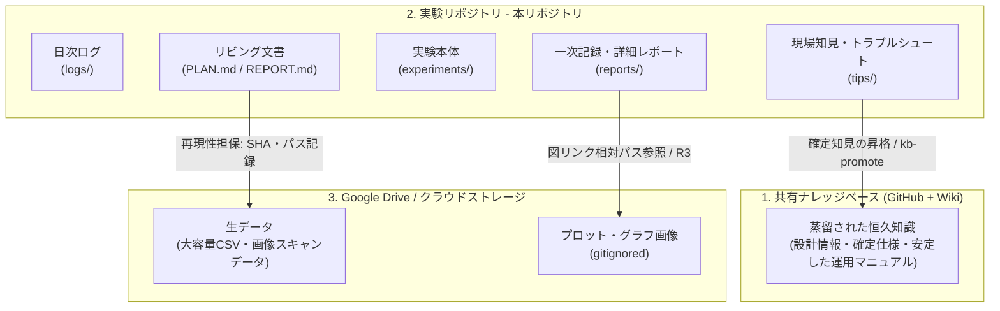

# ワークスペース詳細解説：仕組みと設計思想

本ドキュメントは、本リポジトリにおける知識管理、実験ライフサイクル、各種自動化スクリプト、外部データ連携（Google Drive）、および AI エージェント（Claude Code 等）との協調動作に関する詳細なアーキテクチャおよびシステムメカニズムを解説したものです。

---

## 1. 知識管理の三層構造 (Three-Layer Knowledge Architecture)

本ラボワークスペースは、情報の「確度（信頼性）」と「寿命（永続性）」に基づき、格納場所を以下の 3 つのレイヤーに明確に分離しています。これにより、膨大な実験データに埋もれることなく、高い再現性と検索性を両立させています。



### レイヤー別の役割と特性

| レイヤー | 役割 | 格納情報・データ種別 | ライフサイクル・運用 |
|---|---|---|---|
| **ナレッジベース (KB)** | 蒸留された恒久知識 | 確定仕様、設計情報、確定手順書、再現性の確立したプロトコル | Wikiや同期ツールを活用。推敲された安定文書。PR を経てマージ。 |
| **実験リポジトリ** | 実験・検証のハブ | 計画、解析スクリプト、結果レポート、日次ログ、暫定的な現場知見（**テキスト・コードのみ**） | 追記中心。日々の実験でエントロピーが増大しやすいため、後述の構造規約で整然さを保つ。 |
| **Google Drive** | 大容量データ・図の正本 | 1MB超の生データ、プロット画像、生ログの原本、配布用の図付きスライド | デスクトップ同期。git の肥大化を防ぎ、差分管理が不要なバイナリ・大容量ファイルの正本置き場。 |

---

## 2. ディレクトリ構成とドキュメント設計思想

リポジトリ内のディレクトリ構成は、実験単位の独立性と、将来的な知見の検索性を考慮して設計されています。

### ディレクトリ一覧

- `logs/<YYYY>/` : 日次・トピック単位の作業ログ（`YYYY-MM-DD_<topic>.md`）。その日の目的・やったこと・わかったこと・次の一手を残す。
- `tips/` : 運用で得た現場知見や解析のコツ。確度（仮説 / 検証中 / 検証済み）を明記し、横断検索のインデックス対象となる。
- `experiments/` : 実験の本体。実験 ID（`E###_<topic>`）と 1 対 1 で紐づく独立したディレクトリ群。
- `tools/` : リポジトリの規約を強制・自動化するための共通スクリプト群。
- `docs/` : リポジトリ共通の規約（図の再生成、レポートの書き方）など。
- `.claude/` : Claude Code が使用するカスタムスキル定義（`skills/`）。

### 「1機能 = 1権威」原則とドキュメントの分類

検証が進むにつれて文書が乱立し「どれが最新の正か」が分からなくなるのを防ぐため、文書を **リビング文書** と **一次記録** に厳密に大別し、同一役割の文書を重複して作成しないようにしています。

```
experiments/E###_<topic>/
├── PLAN.md           <-- [リビング] 枠組み・仮説・成功基準 ＋ 最新の測定計画 (計画はここに一本化)
├── REPORT.md         <-- [リビング] 現状サマリ。最初に読む唯一の権威。覆った過去の結論は残さない
├── MANIFEST.md       <-- [リビング] データ所在(Drive)と関連リポジトリの commit SHA を記録する再現台帳
├── DECISIONS.md      <-- [リビング・履歴] (長期のみ) なぜ方針転換したかの決定履歴 (R番号は振らない)
├── regenerate.sh    <-- [スクリプト] 図・プロットを決定論的に再生成するランナー
├── scripts/          <-- [スクリプト] 解析コード
├── reports/          <-- [一次記録] 日付つきの一次レポート群。原則として後から書き換えない
│   ├── INDEX.md      <-- [インデックス] tools/report_meta.py が自動生成する状態付き一覧表
│   └── E###-R###_<YYYYMMDD>_<topic>.md  <-- 個々の詳細レポート (自走して読める前提)
└── data/             <-- [ローカルデータ] git 管理外のローカル作業用キャッシュ
```

---

## 3. 実験ライフサイクルとワークフロー

すべての実験は、以下の確定されたワークフローを辿って実行されます。

1. **実験の立ち上げ (`exp-new`)**:
   - `experiments/_template/` を `experiments/E###_<topic>/` にコピー
     (テンプレは symlink なので `cp -RL …/_template/. <dst>/`)。
   - 実験 ID（デフォルトで `E###`、例: `E001`）を採番。
2. **PLAN.md の起草**:
   - 目的、仮説、関与リポジトリ、計画手順を明記。
3. **MANIFEST.md への記録**:
   - 再現性担保のため、着手時に関与する他のリポジトリの Git Commit SHA を直接書き留める。
   - Google Drive 上の生データパスを記録。
4. **実験・解析・図の再生成 (`regenerate.sh`)**:
   - 解析スクリプトを `scripts/` に書き、図の出力先を `_generated/` に設定。
   - 図は Git 管理せず、Google Drive 上の生データを読み込んで決定論的にローカル再生成できるようにする。
5. **レポート作成 (`exp-report`)**:
   - `reports/E###-R###_*.md` をフロントマター付きで作成。
   - `REPORT.md`（現状サマリ）を更新。
6. **インデックス生成と検証 (`report_meta.py`)**:
   - フロントマターから `experiments/INDEX.md` および `reports/INDEX.md` を自動更新。
   - コミット前の Git Hook 検証でメタデータの不整合をブロック。

---

## 4. 図の再生成ルールとリンク検証 (R1〜R3 規約)

三大原則の第 1 項である「git はテキスト + 生成スクリプトだけ」を厳密に運用するため、図（プロット）はコミットせず、以下の **R1〜R3 規約** に従ってローカル再生成します。これは `tools/check_report_figures.py` を通じて静的に検証されます。

> [!IMPORTANT]
> **図の再生成・リンク 3 大ルール (R1〜R3)**
> - **R1 (入力は Drive 正本)**: 解析スクリプトおよび `regenerate.sh` の入力データは、ローカル同期された Google Drive のパス（環境変数 `LAB_DRIVE` でマウント先を置換可能にしたもの）を直接読み込みます。PC 固有の絶対パス（例: `/Users/<me>/work/...`）は禁止です。
>   - **R1b (未取得データは SKIP)**: 事前登録段階などでまだ測定データが存在しない場合は、スクリプトが `exit 1`（失敗）ではなく **`exit 2`（SKIP）** を返すように設計します。`regenerate.sh` はこれを検知してエラーではなく「スキップ」扱いとし、CI を落としません。
> - **R2 (出力は単一の gitignored ディレクトリ)**: 生成される図の出力先は、実験ディレクトリ直下の単一ディレクトリ（標準テンプレートでは `_generated/`）に統一し、このフォルダは `.gitignore` に登録します。
> - **R3 (レポートの図リンクは出力先のみを指す)**: 各レポート（`REPORT.md` および `reports/**/*.md`）内の画像リンクは、上記 R2 で指定された gitignored フォルダ内のファイルを指す正しい相対パス（例: `../_generated/plot.png`）で記述します。

---

## 5. 自動化と静的検証の仕組み

リポジトリ内のメタデータの整合性およびクリーンさを保つため、コミット時にフックを連動させて自動検証を行っています。

### 5.1 インデックス自動生成・ドリフト検証 (`tools/report_meta.py`)
レポートの YAML フロントマターを「唯一の正本 (Single Source of Truth)」とし、そこから `experiments/INDEX.md` および各実験の `reports/INDEX.md` を自動生成します。
このメタデータ抽出ルールや JIRA との連携有無、実験 ID 形式は `.lab-config.json` にてカスタマイズ可能です。

### 5.2 Jupyter Notebook 出力クリア (`tools/strip_nb_outputs.py`)
Jupyter Notebook (`.ipynb`) はセル出力を含んだ状態で保存すると、git diff が汚れ、リポジトリサイズが肥大化します。
そのため、本ワークスペースでは `*.ipynb` の保存時に自動的に出力をクリアする Git filter を導入しています。

- **仕組み** : `.gitattributes` に `*.ipynb filter=nbstrip` を記述。
- **実体定義 (クローンごとに初回セットアップが必要)** :
  ```powershell
  git config filter.nbstrip.clean "python3 tools/strip_nb_outputs.py"
  git config filter.nbstrip.smudge cat
  ```

---

## 6. AI エージェント連携とカスタムスキル

本リポジトリは、AI 協調コーディングエージェント（Claude Code 等）が効率的に動作できるように、構造化されたカスタムスキル群を配備しています。

### 6.1 カスタムスキル群 (`.claude/skills/`)
定型ワークフローを AI エージェントに正確に実行させるため、手順書をカプセル化したスキルが配備されています。

- `exp-new` : 実験の新規立ち上げ。テンプレートコピー、関与リポの commit SHA 記録、Drive ミラーフォルダ作成、インデックス仮登録までを一括指示。
- `exp-report` : ハウススタイルに準拠したフロントマター設計とレポート構造化の強制。
- `lab-log` : 日次ログの定型記述の生成と配置。
- `kb-promote` : 確定知見の共有ナレッジベースへの昇格と PR 作成フロー。
- `regen-outputs` : 生データからのローカル図再生成プレビュー実行。
- `exp-checkpoint` : 実験の区切りにおける各種リビングドキュメントと INDEX、日次ログの整合性一括アップデート。
